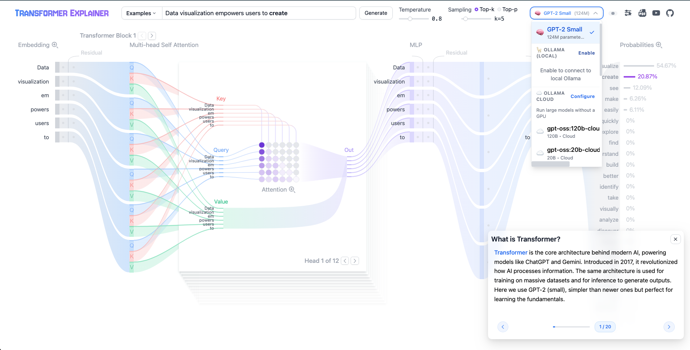

# 2026-interactive-transformer-neural-network-explainer

**Interactive Learning of Text-Generative Models**

## Modern Stack: Vite 8 + Svelte 5 + TypeScript 
**April 8, 2026 by Gregory Kennedy**

The 2026 interactive transformer neural network explainer app is an interactive visualization tool designed to help anyone learn how Transformer-based models like GPT work. It runs a live GPT-2 model right in your browser, or choose between running Openrouter or Ollama local or cloud models, that allows you to experiment with your own text and observe in real time how internal components and operations of the Transformer work together in llm token prediction.

[](http://opensource.org/licenses/MIT)
[](https://arxiv.org/abs/2408.04619)



---

## 🎉 What's New (April 2026)

**✨ Multi-Model Support Added!**

This enhanced version now supports multiple LLM providers beyond GPT-2:

- **🦙 Ollama (Local)** - Run Llama 3.2/3.1/4, Mistral, Gemma, and other models locally
- **☁️ Ollama Cloud** - Access large models without a GPU (GPT-OSS 120B, Gemma 4, etc.)
- **🔌 OpenRouter** - Connect to 100+ models including GPT-5.4, Claude 4.6, Gemini 3.1

Simply click the model selector in the top bar to switch between models!

### Quick Setup for New Features

```bash
# For Ollama Local (optional)
# 1. Install Ollama from https://ollama.com
# 2. Run: ollama serve
# 3. Enable Ollama in the UI dropdown

# For Ollama Cloud (optional)
export OLLAMA_API_KEY=your_key_here

# For OpenRouter (optional)
export OPENROUTER_API_KEY=your_key_here
```

---

## Table of Contents

- [Quick Start](#quick-start) - For the impatient
- [Step-by-Step Setup](#step-by-step-setup) - Detailed installation guide
- [Multi-Model Configuration](#multi-model-configuration) - Setup Ollama & OpenRouter
- [Tech Stack](#tech-stack) - What's under the hood
- [Development Workflow](#development-workflow) - How we build and maintain
- [Project Structure](#project-structure) - Where things live
- [Troubleshooting](#troubleshooting) - When things go wrong
- [Research & Citation](#research--citation)

---

## Quick Start

### For Everyone (5 minutes)

```bash
# 1. Get the code
git clone https://github.com/mindful-ai-dude/transformer-explainer-2026
cd transformer-explainer-2026

# 2. Install dependencies (we use pnpm - install it if you don't have it)
npm install -g pnpm
pnpm install

# 3. Start the app
pnpm dev
```

Open http://localhost:5173 in your browser. That's it!

**Want an even quicker start?** Use the provided scripts:

```bash
# On macOS/Linux
./start.sh

# On Windows
.\start.ps1
```
---

## Step-by-Step Setup

### Prerequisites (What You Need Before Starting)

- **Node.js** version 20 or higher (check with `node --version`)
  - Download from https://nodejs.org if needed
  - We recommend using the LTS (Long Term Support) version
  
- **pnpm** - Our package manager of choice
  - Install with: `npm install -g pnpm`
  - Why pnpm? It's faster and uses less disk space than npm

### Installation Steps

#### Step 1: Download the Project

Click the green "Code" button on GitHub and select "Download ZIP", or use git:

```bash
git clone https://github.com/poloclub/transformer-explainer.git
cd transformer-explainer
```

#### Step 2: Install Dependencies

This downloads all the code libraries the app needs:

```bash
pnpm install
```

> **What is this doing?** It's downloading packages like Svelte (for building the interface), Vite (for running the development server), D3 (for drawing visualizations), and onnxruntime-web (for running the AI model in your browser).

#### Step 3: Start the Development Server

```bash
pnpm dev
```

You'll see messages like:
```
VITE v8.0.4  ready in 2216 ms
➜  Local:   http://localhost:5173/
```

Open that URL in your browser. The page should load showing "Transformer Explainer" with an interactive visualization!

#### Step 4: Stop the Server (When You're Done)

Press `Ctrl+C` in the terminal, or use:

```bash
# On macOS/Linux
./stop.sh

# On Windows  
.\stop.ps1
```
---

## Multi-Model Configuration

The app now supports multiple model providers. Here's how to set them up:

### 🦙 Ollama (Local Models)

1. **Install Ollama**
   ```bash
   # macOS
   brew install ollama
   
   # Linux
   curl -fsSL https://ollama.com/install.sh | sh
   
   # Or download from https://ollama.com/download
   ```

2. **Start Ollama Server**
   ```bash
   ollama serve
   ```

3. **Pull Models** (optional - you can do this from the UI too)
   ```bash
   ollama pull llama3.2
   ollama pull gemma4
   ollama pull mistral3
   ```

4. **Enable in UI**
   - Click the model selector in the top bar
   - Click "Enable" next to "🦙 Ollama (Local)"
   - Available models will appear automatically

### ☁️ Ollama Cloud

For running large models without a GPU:

1. **Create an Ollama account** at https://ollama.com
2. **Get your API key** from https://ollama.com/settings/keys
3. **Set the environment variable:**
   ```bash
   export OLLAMA_API_KEY=your_api_key_here
   ```
   Or configure in the UI by clicking "Configure" next to Ollama Cloud

**Available Cloud Models:**
- GPT-OSS 20B Cloud (OpenAI)
- GPT-OSS 120B Cloud (OpenAI)
- Gemma 4 26B Cloud (Google)
- Qwen3 Coder 30B Cloud (Alibaba)
- DeepSeek V3.1 671B Cloud
- Nemotron 3 Super 120B Cloud (NVIDIA)
- Mistral Large 3 Cloud

### 🔌 OpenRouter

Access 100+ models including GPT-4, Claude, and more:

1. **Create an OpenRouter account** at https://openrouter.ai
2. **Get your API key** from https://openrouter.ai/keys
3. **Set the environment variable:**
   ```bash
   export OPENROUTER_API_KEY=your_api_key_here
   ```
   Or configure in the UI by clicking "Configure" next to OpenRouter

**Available OpenRouter Models:**
- GPT-5.4 (OpenAI)
- Claude 4.6 Opus (Anthropic)
- Claude 4.6 Sonnet (Anthropic)
- Gemini 3.1 Pro (Google)
- Llama 4 (Meta)

---

## Tech Stack

This project uses modern web technologies (verified April 7, 2026):

| Technology | Version | Purpose |
|------------|---------|---------|
| **Vite** | 8.0.7 | Build tool - makes development fast |
| **Svelte** | 5.55.1 | Framework - builds the user interface |
| **SvelteKit** | 2.56.1 | Full-stack framework for Svelte |
| **TypeScript** | 5.8.x | Type safety - catches errors before running |
| **TailwindCSS** | 3.4 | Styling - makes things look nice |
| **D3.js** | 7.x | Data visualization - draws the matrices and diagrams |
| **GSAP** | 3.14.x | Animations - smooth transitions |
| **onnxruntime-web** | 1.24.3 | Runs the GPT-2 model in your browser |
| **pnpm** | 10.x | Package manager |

### What This Means for Users

- **Fast Development**: Changes appear instantly with Hot Module Replacement
- **Type Safety**: TypeScript catches errors before they happen
- **Small Bundle**: Svelte compiles to minimal JavaScript
- **Browser AI**: Runs GPT-2 locally - no data sent to servers

---

## Development Workflow

### How We Keep Dependencies Up-to-Date

This project uses an **AI Agent Development System** with dependency verification:

### AGENTS.md System

The `AGENTS.md` file is our development guide that ensures code quality and up-to-date dependencies:

- **Location**: `AGENTS.md` in the project root
- **Purpose**: Cross-tool instructions for AI assistants (Claude, Copilot, Cursor, etc.)
- **Key Rules**:
  - Always verify current versions from npm/PyPI, not training data
  - Check for security vulnerabilities before adding packages
  - Use pnpm package manager exclusively

### Start/Stop Scripts

For convenience, we provide:

- **`start.sh` / `start.ps1`**: Launch the development server with verbose output
- **`stop.sh` / `stop.ps1`**: Kill running servers with detailed status

---

## Project Structure

```
transformer-explainer/
├── src/
│   ├── components/        # Svelte components (UI, visualizations, popovers)
│   │   ├── common/      # Shared components
│   │   ├── ModelSelector.svelte  # NEW: Model selection dropdown
│   │   └── ModelStatus.svelte    # NEW: Connection status indicator
│   ├── lib/             # Library code
│   │   ├── ollama-client.ts      # NEW: Ollama API wrapper
│   │   ├── model-manager.ts      # NEW: Unified model interface
│   │   └── model-types.ts        # NEW: TypeScript types
│   ├── routes/          # SvelteKit pages
│   ├── store/           # Global state
│   └── utils/           # Helper functions
├── static/              # Static assets
├── docs/                # Documentation
└── skills/              # AI agent skill files
```

---

## Git Workflow for Beginners

This section covers the exact commands to push changes to GitHub. Follow these steps every time you want to save your work to the repository.

### Basic Workflow (Push Changes to GitHub)

```bash
# Step 1: Check what files have changed
git status

# Step 2: Add all your changes to be committed
git add -A

# Step 3: Commit your changes with a descriptive message
git commit -m "Describe what you changed here"

# Step 4: Push to GitHub
git push origin main
```

### Example: Pushing a README Update

```bash
git add README.md
git commit -m "docs: add git workflow section for beginners"
git push origin main
```

### Troubleshooting Common Git Issues

#### ❌ "failed to push some refs to..."
**Cause:** Someone else (or you on another computer) pushed changes before you.

**Solution:**
```bash
# Pull the latest changes first
git pull origin main

# Then push again
git push origin main
```

#### ❌ "cannot lock ref 'refs/heads/main'"
**Cause:** GitHub is processing another push or there's a temporary lock.

**Solution:**
```bash
# Wait 30 seconds and try again
git push origin main

# If that fails, force fetch and retry
git fetch origin
git push origin main
```

#### ❌ "Your branch is behind 'origin/main'"
**Cause:** The remote has changes you don't have locally.

**Solution:**
```bash
# Fetch and merge remote changes
git pull origin main --rebase

# Then push your changes
git push origin main
```

#### ❌ "merge conflict"
**Cause:** You and someone else edited the same lines.

**Solution:**
```bash
# See which files have conflicts
git status

# Edit the files and look for "<<<<<<< HEAD" markers
# Keep the code you want, remove the marker lines

# After fixing, add and commit
git add -A
git commit -m "fix: resolve merge conflict"
git push origin main
```

### Helpful Git Commands

```bash
# See recent commits
git log --oneline -5

# See what changed in a specific file
git diff README.md

# Undo all uncommitted changes (be careful!)
git checkout -- .

# Create a new branch for experimental changes
git checkout -b my-experiment

# Switch back to main
git checkout main
```

---

## Troubleshooting

### "Port 5173 is in use"

Solution: The server is already running. Either:
- Use the existing server at http://localhost:5173
- Run `./stop.sh` (macOS/Linux) or `.

